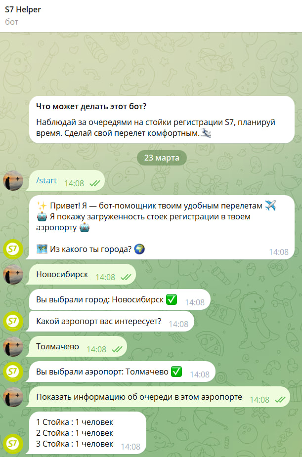

# Аналитические артефакты и описание проекта

## 1) Основные объекты продукта

### Основные объекты:
1 - Telegram-бот: Интерфейс взаимодействия с пользователем. Получает данные с сервера и отображает их пользователю.

2 - Java-сервер: Обрабатывает данные, полученные от Python-кода, и предоставляет их по запросу.

3 - Python-код: Использует OpenCV и ИИ для подсчета людей на стойках регистрации.

4 - Камера: Источник видеопотока для обработки Python-кодом.

### Атрибуты объектов:
Количество людей: Число людей на каждой стойке регистрации.

Стойка регистрации: Уникальный идентификатор стойки.

### Связи:
1 - Python-код отправляет данные на Java-сервер.

2 - Java-сервер хранит данные и предоставляет их по запросу.

3 - Telegram-бот запрашивает данные с сервера и отображает их пользователю.

### Операции:
1 - Подсчет людей с камеры.

2 - Отправка данных на сервер.

3 - Запрос данных ботом.

4 - Отображение результатов пользователю.

## 2) Ролевая модель

### Пользователи:
Пассажиры: Используют Telegram-бот для просмотра информации о количестве людей на стойках регистрации.

Разработчики: Контролируют работу сервера и Python-кода.

### Функции пользователей:
Пассажиры могут отправить запрос и получить информацию о загруженности стоек регистрации.

Администраторы могут отслеживать корректность работы системы и обновлять модель ИИ при необходимости.

### Ограничения:
Пассажир имеет доступ только к функциям просмотра информации.

Администраторы имеют доступ к логам и мониторингу сервера.

## 3) Пользовательские / Функциональные / Нефункциональные требования

### Пользовательские требования:
Пассажир должен иметь возможность узнать количество людей на стойках регистрации.

Интерфейс Telegram-бота должен быть простым и понятным.

### Функциональные требования:
1 - Python-код должен обрабатывать видео и отправлять данные на сервер.

2 - Сервер должен обрабатывать и сохранять данные.

3 - Бот должен отправлять запросы и отображать результаты пользователю.

### Нефункциональные требования:
Время ответа от сервера должно приходить моментально.

## 4) Прототипы интерфейса

### Telegram-бот:
Узнает из какого города человек, и какой аэропорт нужен (пока только для Новосибирска).

А потом кнопка "Показать информацию об очереди в этом аэропорте".

Ответ с числом людей на каждой стойке регистрации.

   

## 5) Перспективы расширения системы

### Будущие функции:
1 - Реализация уведомлений при высокой загруженности стойки.

2 - Добавление поддержки нескольких камер для более точного анализа.

3 - Введение статистики загруженности за определенный период для анализа и подготовки к подобным ситуациям в будущем. Использование машинного обучения для прогнозирования загруженности.

4 - Слежение не только за стойками регистрации, но и за выходами на посадку

### Развитие продукта:
1 - Создание мобильного приложения с расширенным функционалом.

2 - Визуализация при помощи карты и различных цветов, для лучшего отображения загруженности стоек регистрации

2 - Масштабирование системы для работы во всех аэропортах России.

3 - Добавление поддержки нескольких языков.

