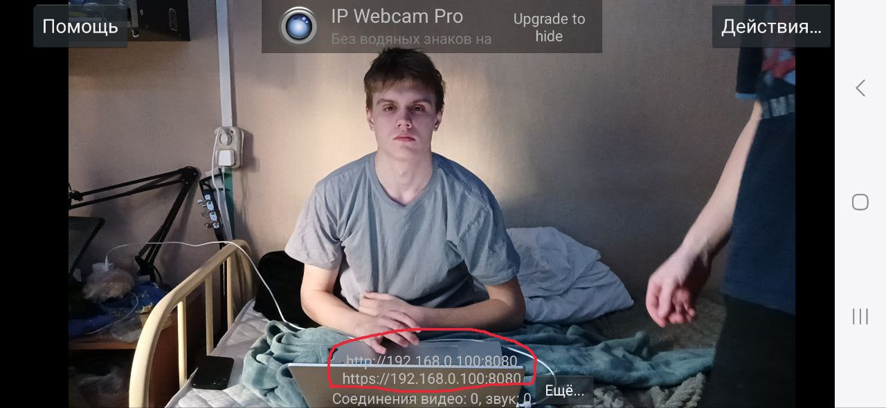
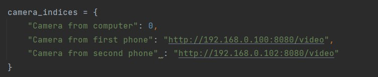

# Техническое решение

Третьим этапом приложите технические артефакты.

**Технические артефакты:**

1) Описание архитектуры решения
- Диаграмма, описывающая решение: [Ссылка на диаграмму](https://miro.com/app/board/uXjVINBMoSM=/)
- Используемые языки:
  - Java: Spring Boot, TelegramBots API, стандартные утилиты java
  - Python: OpenCV (cv2), Caffe – фреймворк для глубинного обучения, json, requests, time
- В качестве данных мы используем изображения с камер. Получаем их с помощью OpenCV, далее их обрабатыввает моделька и отправляет количество людей, которых она смогла обнаружить. Это все струтурируется с помощью словаря и отправляется на сервер в виде json файла.
- В нашем случае используется реализация MobileNet. Модель была экспортирована в формате Caffe. Это включает:
  - deploy.prototxt: Это текстовый файл, который описывает архитектуру нейронной сети
  - mobilenet_iter_73000.caffemodel: Это файл с обученными весами модели.
  В вашем коде модель загружается с помощью OpenCV , что позволяет использовать её для обнаружения людей на видео.
- Мы считаем, что у нас очень хороший потенциал к масштабированию. 
  - Будущие функции:
      - Реализация уведомлений при высокой загруженности стойки.
      - Добавление поддержки нескольких камер для более точного анализа.
      - Введение статистики загруженности за определенный период для анализа и подготовки к подобным ситуациям в будущем.
      - Использование машинного обучения для прогнозирования загруженности.
      - Отслеживание не только стоек регистрации, но и выходы на посадку
  - Развитие продукта:
      - Создание мобильного приложения с расширенным функционалом.
      - Масштабирование системы для работы во всех аэропортах, где работает компания S7
      - Добавление поддержки нескольких языков.

2) Инструкция по развертыванию
- Ссылка github с продуктом в пункте "Исходный код решения"
- Для запуска нашего продукта нужно запустить программы в следующем порядке:
  1) ServerApplication.java в директории server
  2) send_information.py в директории OpenCV
  3) BotApplication.java в директории bot 
- Для корректной работы программы, устройства должны быть в одной локальной сети с разрешенным прямым взаимодействием(когда мы тестили на устройствах, подключенных к университетской сети, программа не работала, так как она не могла получить данные по URL-адресу. В домашней сети или на мобильной раздаче все работает корректно), а также в файле send_information  вставить корректные URL-адресса видеопотока(для этого можно использовать мобильные приложения, например для андройда, "IP Webcam")

   

   

Адресс, обведенный на первом фото должен быть вставлен в значение по ключу "Camera from first phone" или "Camera from second phone" в словаре camera_indices на втором фото
3) Исходный код решения

- [Исходный код решения](https://github.com/miroslav0221/TG-Bot-S7-Hakaton/tree/1d7fce32c9fd4ab0d464a55708ec9a7fa81408af)

4) Демо-стенд

- [Видео с примером работы нашего продукта](https://drive.google.com/drive/folders/1o_33bFJ_r3n6CBTdfLVz46VMpoeMndsr?usp=sharing)
